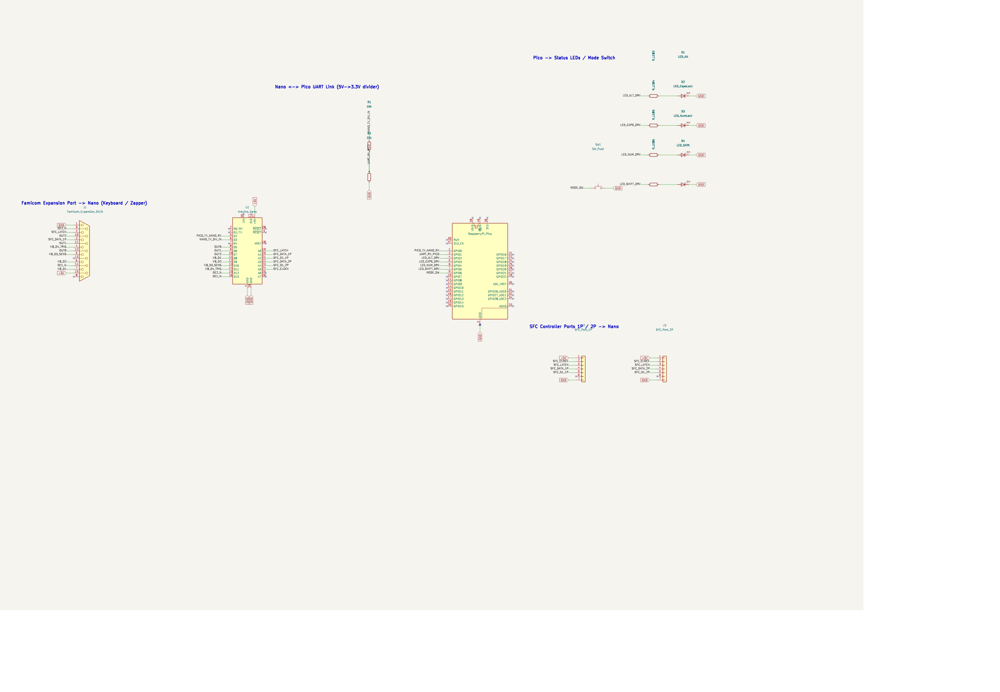

# Famicom Expand USB Adapter

ファミリーベーシックキーボードとファミコン光線銃(ザッパー)を、USB HIDキーボード/マウスとしてPCで使えるようにするアダプター。

Arduino Nano(信号読み取り) + Raspberry Pi Pico(CircuitPython, USB HID出力)の2段構成。


## 全体構成

```
[ファミコン拡張端子(15pin)] --- [Nano: 走査/読み取り] --UART(9600bps)--> [Pico: USB HID出力] --USB--> [PC]
```

- **Nano**: ファミリーベーシックキーボードのマトリクス走査、光線銃(トリガー/センサー)の読み取り。5Vネイティブロジックで駆動(キーボード内部の古いCMOS ICとレベル変換なしで直結するため)。
- **Pico**: CircuitPython動作。UART経由でNanoからのイベントを受信し、USB HIDキーボード/マウスとしてPCに送信。LEDインジケーター制御も担当。

詳しい配線・信号プロトコルは [docs/pinout.md](docs/pinout.md)、配線図は [docs/wiring-diagram.svg](docs/wiring-diagram.svg) を参照してください。

KiCadの正式な回路図(SFCコントローラーポート拡張込み)は [hardware/schematic/famicom-expand-usb-adapter.kicad_sch](hardware/schematic/famicom-expand-usb-adapter.kicad_sch)(閲覧だけなら[PDF](hardware/schematic/famicom-expand-usb-adapter.pdf)でもOK)、結線一覧表は [hardware/wiring/connection_list.xlsx](hardware/wiring/connection_list.xlsx) にあります。



## 実機での動作状況(2026-08-02時点)

- キーボードモード: 動作確認済み
- 光線銃(ザッパー)モード: 実機確認済み(トリガー→左クリック、センサー→右クリック)
- `_` / YENキーのHID Usage値は理論値のまま未実測(要検証)
- SFCコントローラー(標準パッド): **実機確認済み**。ボタン判定(アクティブLow)・並び(L=Q、R=Wなど)とも実装通りで反転不要だった
- SFCマウス: 実機動作は未検証(下記「ファームウェア」参照)

## ファームウェア

- [`firmware/nano/famicom_scanner.ino`](firmware/nano/famicom_scanner.ino) — Nano側。Arduino IDEで書き込み(ボード: Arduino Nano, ATmega328)。
- [`firmware/pico/code.py`](firmware/pico/code.py) — Pico側。CircuitPython + [adafruit_hid](https://github.com/adafruit/Adafruit_CircuitPython_HID) ライブラリが必要(`CIRCUITPY/lib/adafruit_hid` に配置)。Picoのファームウェア自体もCircuitPythonに書き換えておくこと(Arduino/arduino-picoコアでは不可、経緯は下記参照)。

### SFCコントローラー/マウス対応(パッドは実機確認済み、マウスは未検証)

- 1P/2Pとも毎スキャンごとに32bit読み、**先頭バイトが0x00なら自動的にマウスと判定**(標準パッドは切替スイッチ不要、ホットスワップにも対応)
- 標準パッドのボタン(B/Y/Select/Start/Up/Down/Left/Right/A/X/L/R)は**キーボードキーとして出力**(1P: Z/A/RShift/Enter/矢印/X/S/Q/W、2P: テンキー、`code.py`の`KEYMAP_SFC1`/`KEYMAP_SFC2`で変更可能)
- マウスは移動量(dx/dy)・L/Rボタンを`Mouse.move()`/`press()`/`release()`に変換。1P/2Pどちらのマウスも同じUSBマウスカーソルを共有する(OS側の制約、2台同時使用時は移動が混ざる)
- ファミコン側(キーボード/ザッパー)とSFC側は配線・処理とも独立しているため、モード切替スイッチに関係なく**常時同時動作**
- Nano⇔Pico間のUARTは57600bpsに引き上げ(マウスは1回の更新で4バイト必要なため、9600bpsのままだと詰まる)
- ボタン/マウスボタンを押しっぱなしにしても、100ms間隔で状態を再送するようにしてある(Pico側の無通信ウォッチドッグが押しっぱなし中に誤って離してしまうのを防止)

標準パッドの32bit読み出し・ボタン判定(アクティブLow)・並び順(L/RがQ/Wに正しく割り当たることを確認済み)は実機で動作確認済み。CLOCK/LATCHのタイミングも問題なし。

**未検証・要実機確認(マウス)**:
- マウスレポートのL/Rボタンのビット位置(資料によって表記が割れていたため`code.py`側のコメントに従い実測で要修正の可能性あり)
- Y/X移動方向の符号(上下左右が逆に感じたら`famicom_scanner.ino`の`processSFCPort`内の符号を反転)

## ハードウェア

### BOM(部品)

- Arduino Nano x1
- Raspberry Pi Pico x1
- タクトスイッチ x1(モード切替用)
- 抵抗 x6(UART電圧分圧用 10kΩ・22kΩ各1本 + LED電流制限用4本、値は手持ちに合わせて選定)
- LED x4(Shift / Alt / CapsLock / NumLockインジケーター)
- ピンソケット、ピンヘッダー(先曲がり)
- ビニール導線
- ユニバーサル基板: 秋月電子 [103230] 片面ガラスコンポジット・ユニバーサル基板 Bタイプ めっき仕上げ(95×72mm)日本製
- 3Dプリンターで自作した外装(ねじ止め)

外装STLは [`hardware/enclosure/Famicom_ExPand_to_USB_Flame.stl`](hardware/enclosure/Famicom_ExPand_to_USB_Flame.stl)。

### ファミコン拡張端子の取り出し

拡張端子コネクタ単体では基板から取り外せなかったため、ファミコン本体の基板ごと超音波カッターで切り抜いて使用。切り出した基板は結束バンドでユニバーサル基板/外装に固定している。

### SFCコントローラーポート拡張(配線済み、ファームウェア未実装)

スーファミ実機の1P/2Pコントローラーソケットをそのまま流用し、Nanoに追加接続。CLOCK・LATCH・+5V・GNDは1P/2Pで共通(実機と同じ配り方)、DATA線(4番ピン)とD1線(5番ピン、マウス/スーパースコープの拡張データ用)だけ1P/2Pそれぞれ別配線にする。6番ピン(IOBIT、マルチタップ検出用)は信号方向が未検証のため今回は未結線。

配線を楽にするため、SFC関連の信号は**全てアナログ側ピン(A0〜A5)に集約**している:

| 信号 | Nanoピン |
|---|---|
| CLOCK(1P/2P共通) | A5 |
| LATCH(1P/2P共通) | A0 |
| DATA(1P) | A1 |
| D1(1P) | A2 |
| DATA(2P) | A3 |
| D1(2P) | A4 |

当初は配線を減らすためA0・A1をファミコン拡張端子(DA15)の2番・3番ピンとも共用する案だったが、実機解析の結果**2番=AudioOUT、3番=IRQという実信号だと判明**したため共用を撤回、拡張端子側は物理的に切り離し済み。A0〜A5はSFC専用。これにより**ファミコンキーボード/ザッパーとSFCコントローラー/マウスは同時使用可能**(ザッパーとキーボードはDA15ソケットが1つしかないため引き続き排他)。

ファームウェア側の読み取り処理はまだ未実装。配線・回路図・結線一覧表は用意済み。

## 既知の注意点

- キーボードと光線銃はDA15の4番・5番ピンを共用しているため、**同時接続は不可**(実機の前提通り)。トリガーを長押しするとキーボード側のマトリクス走査にも同じ物理ピンの変化が伝わり、擬似的なキーイベントが大量発生することを確認済み(キーボード未接続時は実害なし)。詳細は [docs/pinout.md](docs/pinout.md) 参照。
- DA15の2番・3番ピン(AudioOUT/IRQ)はNanoのA0・A1とは分離済み。SFCコントローラーはファミコンのキーボード/ザッパーと同時使用できる。
- Shift/Alt/Ctrlはすべてトグル方式(押すたびにON/OFF反転)。
- Nano→Pico方向のUARTのみ電圧分圧が必要(Pico→Nanoは直結でOK)。

## 開発の経緯・詰まったポイント(教訓)

1. ESP32-S3で検証を開始したが、3.3VロジックとキーボードのCMOS IC(4017/4019/4069)の相性が悪くチャタリング多発。Nanoの5Vネイティブロジックに変更して安定化。
2. キーボード走査プロトコルはnesdev/goroh氏の解析情報がベース。列選択後の待ち時間は寄生容量対策で300us→500usに増やして安定。
3. デバウンスは「行まるごと」ではなく「1キーごと(72キー個別)」でないと機能しなかった。
4. Arduino(arduino-picoコア)のKeyboardライブラリで「キー張り付き」バグに長時間ハマり、原因を特定できないまま**CircuitPython + adafruit_hidへ全面移行**して解決。
5. JIS配列とUS配列のHID Usage ID対応はズレるため、実測して1つずつ補正した。
6. Shift/Alt/Ctrlをトグル式にしたところ、ウォッチドッグ処理が誤ってShiftにも作用し、Windowsの「固定キー機能」を誤爆させた。ウォッチドッグの対象からShift/Alt/Ctrlのトグル状態を除外して解消。
7. Ctrl単体とShift+Alt同時トグルのLED表示が同じになり区別不能だった → 「Ctrl絡みは必ず点滅、Ctrlなしは必ず固定点灯」に統一。
8. モード切替スイッチのGPIOが一時「不調」と判明し別ピンに変更したが、後日の再検証では元のピンで問題なく動作。原因不明のため、また不調が出たら同様に疑うこと。

## 未確認・要検証事項

- `_`(0x87)、YEN(0x89)キーの実測補正
- ザッパーモードのLEDアニメーション速度(`ZAPPER_ANIM_STEP=0.15秒`)の調整
- SFCコントローラーポート: 実配線済み、Nano側の読み取りファームウェアはまだ未実装
- SFCコントローラーポート6番ピン(IOBIT)の信号方向・用途の実機検証

## 開発者より

- 今回の開発では主にClaudeを使っています。(要所要所の精査とか、雑用とかはGeminiやGPTも使ってる)途中で無料版のトークン制限にげんなりして課金しましたが、ClaudeCodeはいいですね、感動した。(周回遅れ)このレポジトリもClaudeがアップしてくれました。
- 検証とかはほぼほぼしてないです。コードが読めないので。基本的に体当たり検証です。
- 多分やろうと思えばPicoだけでもキーボードは使えます。ただ光線銃やその他周辺機器が必ずしもロジック電圧が合うとは限らないので、汎用性を重視してファミコンと同じ5VロジックのNanoをかましています。
- 問い合わせ先→[https://x.com/R_7_Rocket]

## 参考文献
[https://www.nesdev.org/wiki/Family_BASIC_Keyboard]
[https://nesmd.nomaki.jp/nes2.html]
ファミコンに関するすべてのハッカーに感謝を表します。
